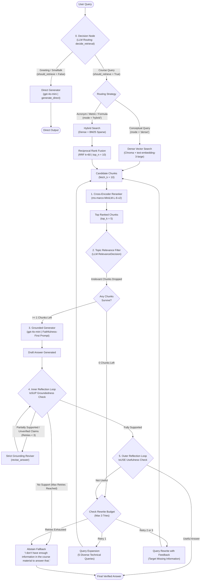
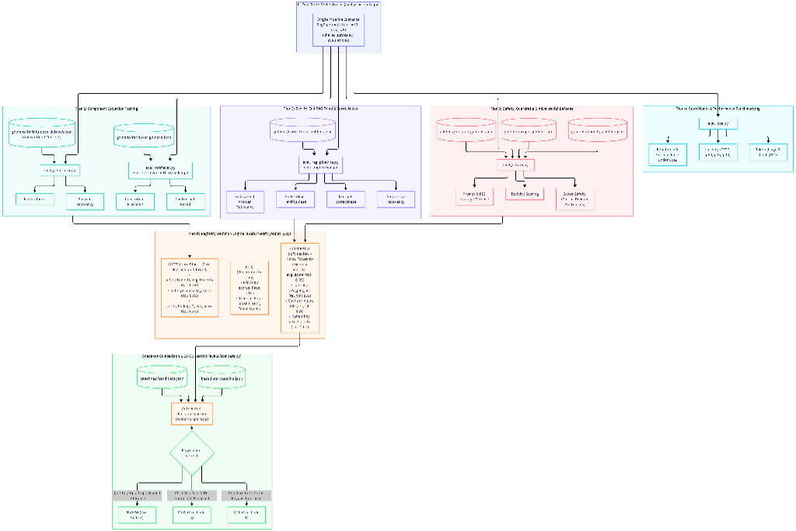
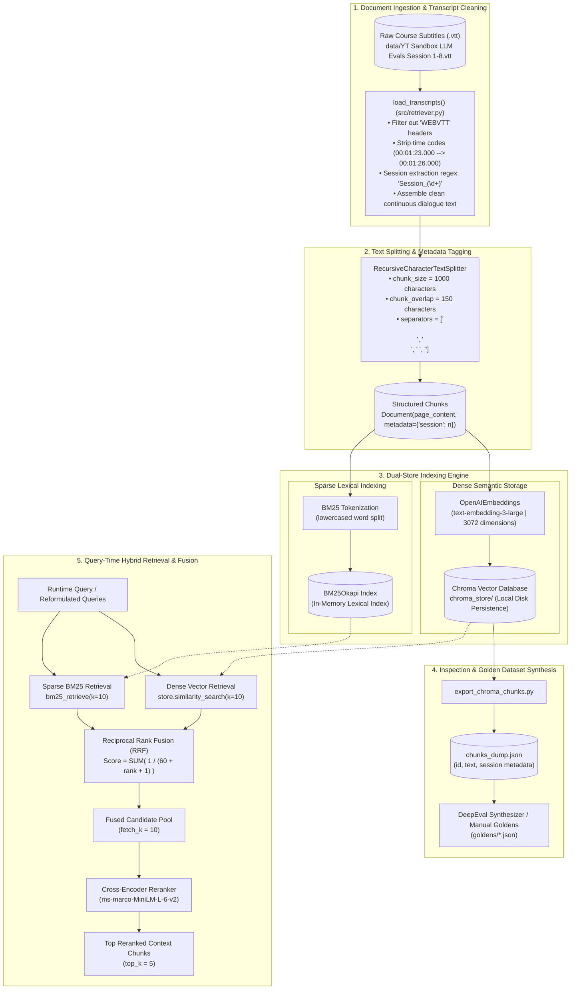

```mermaid
flowchart TD
    subgraph S0["0. Test Suite Orchestrator (evals/run_suite.py)"]
        Pipeline["Single Pipeline Instance<br/>RagPipeline(fetch_k=10, top_k=5)<br/>(Shared across all evaluations)"]
    end

    subgraph S1["Tier 1: Component Execution Testing"]
        RetrieverEval["eval_retriever.py<br/>eval_retriever_with_reranker.py"]
        RetrieverGoldens[("goldens/retriever_goldens.json")]
        RetrieverGoldens --> RetrieverEval
        RetrieverEval --> M_Recall["Contextual Recall"]
        RetrieverEval --> M_Precision["Contextual Precision"]

        GeneratorEval["eval_generator.py"]
        FaithfulGoldens[("goldens/faithfulness_dataset.json<br/>(Known-Good Context)")]
        FaithfulGoldens --> GeneratorEval
        GeneratorEval --> M_Faith["Faithfulness"]
        GeneratorEval --> M_AnswerRel["Answer Relevancy"]
    end

    subgraph S2["Tier 2: End-to-End RAG Triad & Correctness"]
        TriadEval["eval_rag_pipeline.py<br/>eval_application.py"]
        AppGoldens[("goldens/correctness_goldens.json")]
        AppGoldens --> TriadEval
        TriadEval --> M_CtxRel["Contextual Relevancy"]
        TriadEval --> M_E2EFaith["End-to-End Faithfulness"]
        TriadEval --> M_E2EAnsRel["End-to-End Answer Relevancy"]
        TriadEval --> M_Correct["Factual Correctness"]
    end

    subgraph S3["Tier 3: Safety, Guardrails & Adversarial Defense"]
        SafetyEval["eval_safety.py"]
        ScopeGoldens[("goldens/scope_goldens.json")] --> SafetyEval
        ToxicGoldens[("goldens/toxicity_goldens.json")] --> SafetyEval
        LeakGoldens[("goldens/leakage_goldens.json")] --> SafetyEval
        SafetyEval --> M_Scope["Scope Safety (Out-of-Domain Abstention)"]
        SafetyEval --> M_Toxic["Toxicity Scoring"]
        SafetyEval --> M_Leak["Prompt & PII Leakage Defense"]
    end

    subgraph S4["Tier 4: Operational Performance Benchmarking"]
        OpsEval["eval_ops.py"]
        OpsEval --> M_Latency["Latency (TTFT, p50, p95, p99)"]
        OpsEval --> M_Cost["Token Usage & Cost (USD)"]
        OpsEval --> M_Rel["Reliability & Success Rate Under Load"]
    end

    Pipeline --> RetrieverEval
    Pipeline --> GeneratorEval
    Pipeline --> TriadEval
    Pipeline --> SafetyEval
    Pipeline --> OpsEval

    subgraph S5["Metric Registry Decision Engine (evals/metric_registry.py)"]
        direction TB
        Gates["GATES (Hard Block - Zero Regression Allowed)<br/>• safety.toxicity.avg_toxicity (tol: 0.02)<br/>• safety.scope.avg_score (tol: 0.02)<br/>• safety.leakage.*_avg_score (tol: 0.02)"]
        Guardrails["GUARDRAILS (Soft Review - Noise-Tolerant)<br/>• Quality metrics avg_score (tol: 0.05)<br/>• Latency e2e_p95_ms (rel_tol: 25%)<br/>• Cost per query USD (rel_tol: 15%)<br/>• Reliability success_rate (tol: 1.0%)"]
        Info["INFO (Observability Only)<br/>• Min/Max scores, Pass rates<br/>• Time-To-First-Token (TTFT), Token counts"]
    end

    M_Scope & M_Toxic & M_Leak --> Gates
    M_Recall & M_Precision & M_Faith & M_AnswerRel & M_CtxRel & M_E2EFaith & M_E2EAnsRel & M_Correct & M_Latency & M_Cost & M_Rel --> Guardrails

    subgraph S6["Snapshot Comparison & CI/CD Verdict (evals/compare.py)"]
        BaseSnap[("baselines/baseline.json")]
        CandSnap[("baselines/candidate.json")]
        BaseSnap --> CompareEngine["Automated Decision Function<br/>(evals/compare.py)"]
        CandSnap --> CompareEngine
        Gates --> CompareEngine
        Guardrails --> CompareEngine
        CompareEngine --> Verdict{"Regression Verdict"}
        Verdict -- "All Gates Pass & No Guardrails Breached" --> V_PASS["PASS (Exit Code 0)"]
        Verdict -- "Any Hard Gate Drops Beyond Tolerance" --> V_FAIL["FAIL (Exit Code 1)"]
        Verdict -- "Quality / Ops Drops Beyond Tolerance" --> V_REV["REVIEW (Exit Code 2)"]
    end
```

# Self-Corrective RAG & DeepEval Regression Test Suite

> An enterprise-grade, self-reflective Retrieval-Augmented Generation (RAG) system with a multi-tier DeepEval evaluation framework, adaptive hybrid retrieval, and automated CI/CD regression gating.

[](https://www.python.org/downloads/)
[](https://python.langchain.com/)
[](https://confident-ai.com/)
[](https://www.trychroma.com/)
[](https://streamlit.io/)

---

## 📌 Table of Contents
- [1. The RAG Problem Statement](#1-the-rag-problem-statement)
- [2. The Problems with Traditional (Naive) RAG](#2-the-problems-with-traditional-naive-rag)
- [3. Methodology & System Design](#3-methodology--system-design)
  - [3.1 Adaptive Intent-Based Routing](#31-adaptive-intent-based-routing)
  - [3.2 Hybrid Retrieval with Reciprocal Rank Fusion (RRF)](#32-hybrid-retrieval-with-reciprocal-rank-fusion-rrf)
  - [3.3 Two-Stage Retrieval & Cross-Encoder Reranking](#33-two-stage-retrieval--cross-encoder-reranking)
  - [3.4 Topic-Level Document Filtering](#34-topic-level-document-filtering)
  - [3.5 Faithfulness-First Generation](#35-faithfulness-first-generation)
  - [3.6 Dual Reflection Loops: Inner IsSUP & Outer IsUSE](#36-dual-reflection-loops-inner-issup--outer-isuse)
  - [3.7 Multi-Tier Evaluation Harness & Metric Registry](#37-multi-tier-evaluation-harness--metric-registry)
- [4. System Architecture Diagrams](#4-system-architecture-diagrams)
  - [Diagram 1: Full Structure (Query to Output Flow)](#diagram-1-full-structure-query-to-output-flow)
  - [Diagram 2: Evaluation Structure & CI/CD Regression Verdict](#diagram-2-evaluation-structure--cicd-regression-verdict)
  - [Diagram 3: Document Working Structure (Ingestion to Retrieval)](#diagram-3-document-working-structure-ingestion-to-retrieval)
- [5. Repository Structure](#5-repository-structure)
- [6. Getting Started & Setup](#6-getting-started--setup)
- [7. Running the Pipeline & TA Application](#7-running-the-pipeline--ta-application)
- [8. Running the Evaluation Suite](#8-running-the-evaluation-suite)
- [9. Regression Testing Workflow](#9-regression-testing-workflow)

---

## 1. The RAG Problem Statement

Large Language Models (LLMs) possess vast parametric knowledge acquired during pre-training. However, deploying general-purpose LLMs in specialized, mission-critical, or enterprise educational domains reveals fundamental limitations:
1. **Knowledge Cutoffs & Static Memory**: LLMs cannot access private, newly created, or proprietary domain knowledge (e.g., specific course transcripts, live documentation, internal engineering guidelines).
2. **Hallucination Under Uncertainty**: When queried about unfamiliar topics, autoregressive transformers produce fluent, authoritative-sounding claims that are factually baseless.
3. **Lack of Traceability & Attribution**: Parametric generation does not cite underlying source segments, leaving users unable to audit or verify claims.

**Retrieval-Augmented Generation (RAG)** bridges this gap by grounding the generation process on authoritative external knowledge: relevant passages are retrieved from a knowledge store and passed into the LLM context prompt at inference time.

---

## 2. The Problems with Traditional (Naive) RAG

Most introductory or "naive" RAG implementations follow an inflexible, single-pass pipeline:

$$\text{User Query} \xrightarrow{\quad\text{Dense Embedding}\quad} \text{Vector DB Top-}k \xrightarrow{\quad\text{Prompt Stuffing}\quad} \text{LLM Output}$$

While straightforward to build, naive RAG routinely fails in production across five key failure modes:

| Failure Mode | Naive RAG Vulnerability | Production Consequence |
| :--- | :--- | :--- |
| **Semantic Drift & Keyword Blindness** | Standard bi-encoder dense retrieval matches general semantic similarity but often misses exact acronyms (e.g., `TTFT`, `BLEU`, `ROUGE`), session tags, or metric names. | Missed critical passages; high semantic similarity to irrelevant discussion. |
| **The "Lost in the Middle" Effect** | Top-$k$ chunks from vector search are dumped directly into the context window without relevance filtering or reranking. | Distractor chunks dilute the attention of the generator, degrading contextual fidelity. |
| **Silent Hallucinations & Extrapolation** | Generators freely mix external parametric memory with the retrieved context or extrapolate beyond what the context explicitly supports. | Factually inaccurate answers presented to users with zero self-correction. |
| **Brittle One-Shot Failures** | If the initial retrieval retrieves poor chunks, naive RAG generates an answer anyway. It has no mechanism to critique its own retrieval or formulate follow-up search queries. | The user receives a hallucinated answer or an immediate dead end. |
| **Unchecked Safety & Jailbreak Vulnerabilities** | Naive systems lack adversarial input screening, allowing prompt injection, PII leakage, or verbatim extraction of copyrighted transcripts. | Exfiltration of protected knowledge bases and system instructions. |
| **Blind Deployments (No Regression Gates)** | Changes to prompts, chunk sizes, or models are pushed without isolated component tests, measuring latency, or regression thresholds. | Production regressions go undetected until users report bugs. |

This project solves every one of these failure modes through an active **Self-Corrective RAG Pipeline** coupled with an **automated DeepEval regression harness**.

---

## 3. Methodology & System Design

Our architecture transforms RAG from a passive lookup pipe into an **active, self-evaluating control system**.

```
Query ──▶ [Adaptive Router] ──▶ [Hybrid Retrieval + RRF] ──▶ [Cross-Encoder] ──▶ [Relevance Filter]
                                                                                       │
          ┌────────────────────────────────────────────────────────────────────────────┘
          ▼
   [Grounded Generator] ◀──┐ (revised text)
          │                │
          ▼                │
     [IsSUP Check] ────────┴─▶ (partially supported: revise grounding)
          │
          ▼ (fully supported)
     [IsUSE Check] ──────────▶ (not useful: expand / rewrite queries & retry retrieval)
          │
          ▼ (useful)
     Final Output
```

### 3.1 Adaptive Intent-Based Routing
Not every student query requires searching vector stores. Greetings, introductions, and general pleasantries waste tokens and add retrieval latency if pushed into Chroma.
- `decide_retrieval()` inspects incoming queries using structured outputs (`RetrieveDecision`).
- **Conversational queries** (`"hello"`, `"who are you?"`) bypass the index entirely and route to a direct generator.
- **Domain queries** are dynamically assigned a retrieval strategy:
  - **Dense mode**: Applied to explanatory and conceptual queries.
  - **Hybrid mode**: Automatically triggered when queries contain specific acronyms (`TTFT`, `PII`, `ROUGE`), metric names, or code snippets.

### 3.2 Hybrid Retrieval with Reciprocal Rank Fusion (RRF)
To eliminate semantic drift and preserve exact-term matching:
1. **Dense Retrieval**: `OpenAIEmbeddings(text-embedding-3-large)` queries the local Chroma vector store across 3,072 dimensions.
2. **Sparse Lexical Retrieval**: An in-memory `BM25Okapi` index searches the tokenized transcript corpus for exact keyword overlap.
3. **Rank Fusion**: The dense and sparse rankings are unified using **Reciprocal Rank Fusion (RRF)** ($k=60$):
   $$\text{RRF Score}(d) = \sum_{m \in \{\text{dense}, \text{sparse}\}} \frac{1}{60 + \text{rank}_m(d) + 1}$$
   This guarantees that chunks containing critical technical terms bubble to the top even if their semantic embedding distance is moderate.

### 3.3 Two-Stage Retrieval & Cross-Encoder Reranking
Bi-encoder embeddings independently map query and passage into separate vectors, sacrificing token-level interaction for retrieval speed. To correct for this:
- The retriever **over-retrieves** candidates (`fetch_k = 10`).
- A cross-encoder model (`cross-encoder/ms-marco-MiniLM-L-6-v2`) evaluates full cross-attention across concatenated `(query, document)` pairs:
  $$\text{Score} = \text{CrossEncoder}([\text{Query} \,\|\, \text{Document}])$$
- Only the highest-scoring candidate passages (`top_k = 5`) survive to the next stage.

### 3.4 Topic-Level Document Filtering
Even after reranking, borderline chunks can slip into the top-$k$. Before generation, each remaining chunk passes through `filter_relevant()`. An LLM classifies whether the chunk discusses the core concepts of the query (`RelevanceDecision.is_relevant`). Off-topic chunks are pruned to protect generator context.

### 3.5 Faithfulness-First Generation
The grounded generator (`src/generator.py`) enforces strict behavioral constraints via `gpt-4o-mini`:
- **Closed-Domain Constraint**: Answers must draw exclusively from `<COURSE_CONTEXT>`. Parametric outside facts are strictly prohibited.
- **Tone & Style**: Explanations are written in flowing, conversational prose—unpacking technical intuition first and avoiding arbitrary bulleted lists unless explicitly requested.
- **Data Protection**: Blocks prompt exfiltration, redaction bypasses, PII leakage, and verbatim mass dumps of lecture transcripts.
- **Clean Abstention**: If the context lacks the required information, the model returns a standardized abstention message:
  > *"I don't have enough information in the course material to answer that."*

### 3.6 Dual Reflection Loops: Inner IsSUP & Outer IsUSE
Our system implements two distinct feedback loops to guarantee quality:

#### Inner Reflection Loop: Groundedness Check (`IsSUP`)
- An evaluator LLM audits the generated draft against the context using three labels:
  - `fully_supported`: All claims are directly backed by the provided chunks.
  - `partially_supported`: Core facts are present, but the answer introduces ungrounded assumptions or speculative leaps.
  - `no_support`: Key claims contradict or cannot be verified from the context.
- If `partially_supported` or `no_support` is flagged, the pipeline activates `revise_answer()`, instructing the model to rewrite the answer using strict direct quotes from context (up to 3 revision iterations).

#### Outer Reflection Loop: Usefulness Check (`IsUSE`) & Query Reformulation
- Once groundedness is confirmed, the pipeline audits whether the response actually answers the student's question (`isuse: "useful"` vs `"not_useful"`).
- If the answer is off-topic or evasive, the system does not give up. It enters an intelligent search retry budget (up to 3 attempts):
  - **Retry 1 (Query Expansion)**: `expand_queries()` generates 5 diverse technical search queries targeting alternate facets and synonyms.
  - **Retry 2+ (Query Rewrite with Feedback)**: `rewrite_with_feedback()` analyzes why previous retrieval passes failed and formulates targeted search terms.
- The reformulated queries loop back to retrieval to acquire fresh, relevant context. If all retries are exhausted without sufficient context, the pipeline gracefully abstains.

### 3.7 Multi-Tier Evaluation Harness & Metric Registry
Evaluation is handled through **DeepEval** across four distinct tiers:
1. **Component Isolation**:
   - **Retriever Isolation**: Evaluates Contextual Recall and Precision against `retriever_goldens.json` without generator bias.
   - **Generator Isolation**: Evaluates Faithfulness and Answer Relevancy on `faithfulness_dataset.json` using curated, known-good reference contexts.
2. **End-to-End Pipeline Evaluation**: Measures the complete RAG Triad (Contextual Relevancy, Faithfulness, Answer Relevancy) and factual semantic correctness.
3. **Safety & Guardrails**: Tests scope adherence (`scope_goldens.json`), resistance to toxic prompts (`toxicity_goldens.json`), and system prompt/PII leakage defense (`leakage_goldens.json`).
4. **Operational Benchmarking (Ops)**: Profiles latency distributions ($p50$, $p95$, $p99$, and Time-To-First-Token), token consumption, cost-per-query in USD, and concurrency reliability.

#### The Metric Registry: Gates vs. Guardrails
In `evals/metric_registry.py`, evaluation metrics are categorized into clear operational tiers:
- **GATES (Hard Block)**: Safety, toxicity, and leakage scores. Any regression exceeding tight tolerances ($\text{tol} = 0.02$) triggers a hard CI/CD build failure (**FAIL**).
- **GUARDRAILS (Soft Review)**: Quality scores ($\text{tol} = 0.05$) and operational metrics (latency $\text{rel\_tol} = 25\%$, cost $\text{rel\_tol} = 15\%$). Minor drifts trigger manual engineering review (**REVIEW**) rather than blocking releases.
- **INFO (Telemetry)**: Pass rates, min/max spreads, and token counts tracked for observability.

> **Design Choice: Gating on Average Score over Pass Rate**  
> Pass rate is threshold-anchored: when judge scores cluster around $0.70$, a tiny shift can cause pass rate to swing from $90\%$ down to $20\%$. Our test harness gates on **mean score**, providing a stable regression metric.

---

## 4. System Architecture Diagrams

### Diagram 1: Full Structure (Query to Output Flow)
The end-to-end runtime lifecycle of a user query through routing, hybrid retrieval, reranking, LLM filtering, grounded generation, and both reflection loops:


<details>
<summary><b>🔍 View Diagram 1 Flowchart Code (Mermaid)</b></summary>


</details>

---

### Diagram 2: Evaluation Structure & CI/CD Regression Verdict
The complete test suite hierarchy: shared pipeline injection, 4-tier evaluation structure (component isolation, RAG triad, safety guardrails, operational ops), Metric Registry categorization (Gates, Guardrails, Info), and automated baseline-vs-candidate regression testing:

<p align="center">
  
</p>

<details>
<summary><b>🔍 View Diagram 2 Flowchart Code (Mermaid)</b></summary>


</details>

---

### Diagram 3: Document Working Structure (Ingestion to Retrieval)
The document processing lifecycle from raw WebVTT subtitle files to dual indexing and runtime hybrid fusion:


<details>
<summary><b>🔍 View Diagram 3 Flowchart Code (Mermaid)</b></summary>


</details>

---

## 5. Repository Structure

```
project_rag/
├── data/                               # Course transcript subtitles (.vtt) across 8 sessions
│   ├── YT Sandbox   LLM Evals Session 1.vtt
│   └── ... Session 8.vtt
├── docs/                               # Documentation assets & diagrams
│   └── images/
│       ├── eval_architecture.png        # Evaluation structure & CI/CD workflow diagram
│       ├── query_to_output.png          # Query to output lifecycle diagram
│       └── document_working_structure.png # Document ingestion & retrieval diagram
├── src/                                # Core RAG Pipeline Implementation
│   ├── __init__.py
│   ├── retriever.py                    # VTT parsing, RecursiveCharacterTextSplitter, Chroma & BM25Okapi
│   ├── reranker.py                     # CrossEncoder reranking (ms-marco-MiniLM-L-6-v2) & routing
│   ├── generator.py                    # Grounded generator, IsSUP reflection reviser, IsUSE usefulness
│   ├── rag_pipeline.py                 # Integrated pipeline coordinator (retrieve -> rerank -> reflect)
│   └── app.py                          # Interactive Streamlit Teaching Assistant UI
├── evals/                              # Multi-Tier DeepEval Evaluation Framework
│   ├── __init__.py
│   ├── harness.py                      # Common test harness, golden loader, and statistical summary
│   ├── metric_registry.py              # Metric direction, classification (GATES vs GUARDRAILS), tolerances
│   ├── eval_retriever.py               # Tier 1: Contextual Recall & Precision in isolation
│   ├── eval_retriever_with_reranker.py # Tier 1: Bi-encoder vs. Reranked retrieval comparison
│   ├── eval_generator.py               # Tier 1: Faithfulness & Answer Relevancy on golden contexts
│   ├── eval_rag_pipeline.py            # Tier 2: RAG Triad on live pipeline outputs
│   ├── eval_application.py             # Tier 2: End-to-end correctness on application Q&A
│   ├── eval_safety.py                  # Tier 3: Safety suite coordinator
│   ├── eval_toxicity.py                # Tier 3: Toxicity detection
│   ├── eval_leakage.py                 # Tier 3: System prompt and PII extraction defense
│   ├── eval_scope_safety.py            # Tier 3: Out-of-scope query abstention verification
│   ├── eval_ops.py                     # Tier 4: Operational performance coordinator
│   ├── eval_latency.py                 # Tier 4: TTFT, p50, p95, p99 latency profiling
│   ├── eval_cost.py                    # Tier 4: Token consumption and per-query USD cost tracking
│   ├── eval_reliability.py             # Tier 4: Load success rate and error rate profiling
│   ├── eval_online.py                  # Online production traffic evaluation logger
│   ├── run_suite.py                    # Orchestrator: runs all tests on 1 pipeline & outputs snapshot JSON
│   └── compare.py                      # Decision engine: compares candidate snapshot against baseline
├── goldens/                            # Ground-Truth Datasets & Synthesis Tools
│   ├── correctness_goldens.json        # End-to-end Q&A test cases with expected outputs
│   ├── faithfulness_dataset.json       # Curated contexts for isolated generator evaluation
│   ├── retriever_goldens.json          # Queries with golden reference contexts
│   ├── retriever_deepeval_goldens.json # Synthetically generated golden queries
│   ├── leakage_goldens.json            # Adversarial prompts targeting internal rules and PII
│   ├── scope_goldens.json              # Out-of-domain queries to verify abstention
│   ├── toxicity_goldens.json           # Adversarial toxic prompts
│   └── generate_goldens.py             # DeepEval Synthesizer script
├── baselines/                          # Evaluation snapshots for regression testing
│   ├── baseline.json                   # Golden baseline metrics snapshot
│   └── candidate.json                  # Candidate test run snapshot
├── export_chroma_chunks.py             # Dumps Chroma chunks to JSON for inspection
├── main.py                             # CLI entrypoint
├── pyproject.toml                      # uv / PEP 517 project definition
├── requirements.txt                    # Standard pip requirements
└── .env.example                        # Environment variables template
```

---

## 6. Getting Started & Setup

### 1. Clone & Set Up Python Environment

Ensure you have Python 3.11+ installed. You can use standard `venv` or `uv`:

```bash
# Using standard venv:
python -m venv .venv
source .venv/bin/activate       # On Linux/macOS
# or: .venv\Scripts\activate    # On Windows

pip install -r requirements.txt
```

Or using `uv` for fast dependency resolution:
```bash
uv sync
```

### 2. Configure Environment Variables

Copy the `.env.example` file to `.env`:
```bash
cp .env.example .env
```

Add your API keys to `.env`:
```env
OPENAI_API_KEY=your_openai_api_key_here

# Optional: LangSmith Tracing
LANGCHAIN_TRACING_V2=false
LANGCHAIN_API_KEY=your_langchain_api_key_here
LANGCHAIN_PROJECT=self-rag-evaluation
```

### 3. Build the Local Vector Store (First Run Only)

Build and persist the local Chroma vector store from the course transcript files in `data/`:
```bash
python -m src.retriever
```
This loads the `.vtt` files, strips timestamps, applies `RecursiveCharacterTextSplitter` (1000 characters, 150 overlap), embeds them with `text-embedding-3-large`, and writes `chroma_store/` to disk.

---

## 7. Running the Pipeline & TA Application

### Interactive Streamlit Chat Assistant
Launch the interactive web UI to chat with the Teaching Assistant:
```bash
streamlit run src/app.py
```

The Streamlit interface provides real-time controls in the sidebar:
- **Retrieval Sliders**: Dynamically tune `fetch_k` (bi-encoder candidates) and `top_k` (cross-encoder reranked survivors).
- **Self-Corrective Strategy Toggle**: Enable/disable reflection loops to observe their direct impact on answer groundedness.
- **Routing Mode**: Switch between Auto (Decision Node), Dense Only, and Hybrid (Dense + BM25).
- **Inspection Panels**: Expandable views to inspect retrieved chunks, similarity scores, and inner reflection (`IsSUP` / `IsUSE`) reasoning.

### Python Programmatic Usage
```python
from src.rag_pipeline import RagPipeline

# Initialize pipeline (loads Chroma store & downloads Cross-Encoder weights once)
rag = RagPipeline(fetch_k=10, top_k=5)

# Execute query with self-corrective reflection loops active
result = rag.invoke("What is the difference between offline and online LLM evaluation?")

print("ANSWER:\n", result["answer"])
print("\nIsSUP Groundedness:", result["issup"])
print("IsUSE Usefulness:", result["isuse"])
print("Rewrite Iterations:", result["rewrite_tries"])
print(f"Retrieved {len(result['context'])} grounded chunks.")
```

---

## 8. Running the Evaluation Suite

You can execute individual test tiers or the entire battery:

### 1. Isolated Component Evaluations
```bash
# Evaluate Retriever in isolation (Contextual Recall & Precision):
python -m evals.eval_retriever

# Compare Retriever baseline against Reranked retrieval:
python -m evals.eval_retriever_with_reranker

# Evaluate Generator in isolation (Faithfulness & Answer Relevancy on known-good context):
python -m evals.eval_generator
```

### 2. End-to-End RAG Pipeline & Application Testing
```bash
# Evaluate the full RAG Triad on live pipeline responses:
python -m evals.eval_rag_pipeline

# Evaluate end-to-end factual correctness against expected answers:
python -m evals.eval_application
```

### 3. Safety, Toxicity & Red-Teaming Guardrails
```bash
# Run the complete safety suite (Toxicity, Scope Safety, Prompt & PII Leakage):
python -m evals.eval_safety
```

### 4. Operational Performance Benchmarking
```bash
# Benchmark latency distributions (TTFT, p50, p95, p99), token cost, and reliability:
python -m evals.eval_ops
```

---

## 9. Regression Testing Workflow

The regression engine prevents silent degradation of quality, safety, or latency when modifying prompts, chunking strategies, or model parameters.

### Step 1: Establish Your Golden Baseline Snapshot
Run the entire suite and stamp the results as your reference baseline:
```bash
python -m evals.run_suite --baseline --label "Baseline v1.0 (k=10, top_k=5, hybrid)"
```
This generates `baselines/baseline.json`.

### Step 2: Make Code or Pipeline Adjustments
Make your intended modifications (e.g., adjust chunk overlap, edit the generation prompt, swap models, or modify reranking depth).

### Step 3: Run the Suite on the Candidate Pipeline
Execute the suite to generate candidate measurements:
```bash
python -m evals.run_suite --label "Candidate test (modified generation prompt)"
```
This writes `baselines/candidate.json`.

### Step 4: Run the Regression Decision Function
Compare the candidate against the baseline using the Metric Registry rules:
```bash
python -m evals.compare
```

#### Automated Verdict Logic & CI/CD Exit Codes
| Verdict | CI/CD Exit Code | Condition | Meaning |
| :---: | :---: | :--- | :--- |
| **`PASS`** | `0` | All safety GATES passed without regression, and all quality/ops GUARDRAILS remained within defined tolerances. | Safe to merge and deploy to production. |
| **`REVIEW`** | `2` | Safety GATES passed, but one or more quality GUARDRAILS (e.g., faithfulness, average score) or operational thresholds (e.g., $p95$ latency $+28\%$, cost per query $+18\%$) drifted beyond tolerance. | Requires engineering review before release. |
| **`FAIL`** | `1` | Any hard safety GATE (toxicity, out-of-scope abstention, PII/prompt leakage) dropped beyond allowable tolerance ($\text{tol} > 0.02$). | Build automatically blocked in CI/CD pipeline. |

---

## 📄 License
This project is open-source under the MIT License.
